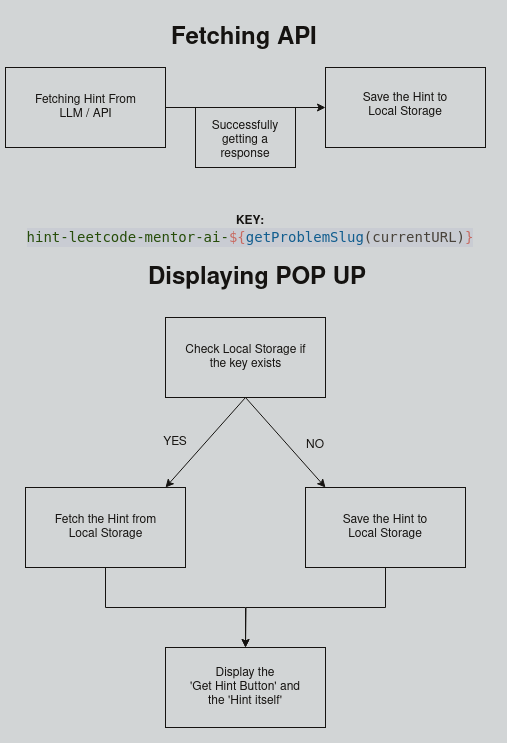

# Leetcode Mentor

LeetCode Mentor AI is a Firefox extension that assists users in solving LeetCode problems by providing intelligent, real-time hints and insights powered by the user's choice of Large Language Model (LLM), seamlessly integrating with LeetCode to offer personalized guidance on problem pages

## Features

- **Customizable LLM Selection**: Users can choose their preferred Large Language Model (LLM) for generating problem-solving hints.
- **Real-time Hints**: Provides immediate, AI-powered suggestions for LeetCode problems.
- **Seamless Integration**: Works directly on LeetCode problem pages for a smooth user experience.
- **Personalized Guidance**: Offers tailored hints based on the specific problem you're solving.
- **Session-based Hint Caching**: Temporarily stores hints during the session to avoid repeated API calls.
- **User-friendly Interface**: Clean and simple UI, allowing users to easily view and refresh hints.

## Docs

### Basic Caching Algorithm to Save Data (Hints)

Caching (here) is necesssary because the hint itself is lost whe the extension window closes.  
It is better to save it so that the reader can go back to the hint, whist simultaneously solving the problem and also limiting API calls.

> Can't use Session Storage because the session data is lost everytime the pop up extension closes. This is because an extension has its own storage and console. Hence the data doesn't persist.
